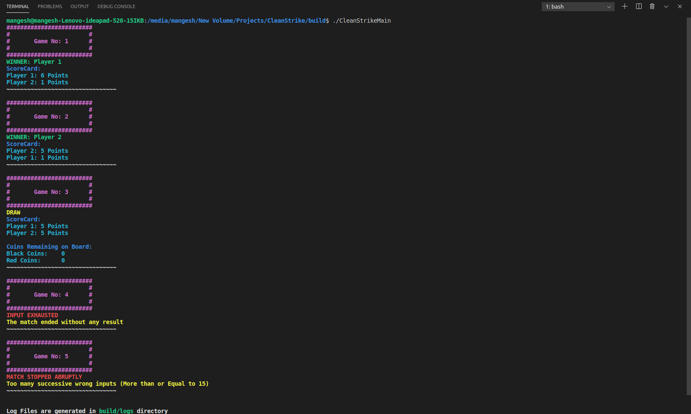

# CleanStrike

CleanStrike is new Carromboard game played by two players taking alternate multiple turns

## Features !

- Input from a txt file is provided
- Build system using **CMake**
- Support for testing provided with the help of **Google Test Framework**
- Support for **Docker** is also provided

# How to run?

## 1. Using Docker

_Make sure you have docker installed in your system_

1. First build the docker image
   > docker build -t <your_user_name>/cleanstrike .
2. Run the docker image
   > docker run <your_user_name>/cleanstrike

and, Voila! It is done. (_Tests and Main program will be executed simultaneously_)

## 2. Using CMake

1. Build the project and run Makefile

   - Create a directory named `build` source folder
     > mkdir build
   - Go to `build` directory
     > cd build
   - Run CMake command
     > cmake ..
   - Build the project
     > make

2. To run the **Main program** execute following in `build` folder

   > ./CleanStrikeMain

   

3. To run the **Tests**

   - Go to `build/tests`
     > cd build/tests
   - Execute following

     > ./CleanStrikeTests

     

# How to give custom input

To give custom input just add another line in `src/inputs/inputFile.txt`

> **! Warning** - If you appended your input to previous input's line then it will be added to previous match.

> **! Warning** - In input if there are at least 15 continous invalid inputs (**Anything other than - 1 2 3 4 5 or 6**) then match will end immediately without any result

> _You can provide your custom txt file also ! For that just change the path in `src/main.cpp` to your input file location and you are good to go !_

# How to See logs

**Logs** are generated for each match in the `build/logs` directory

